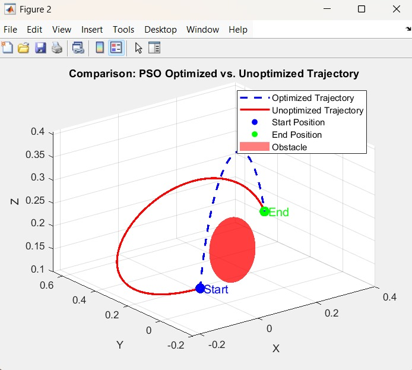
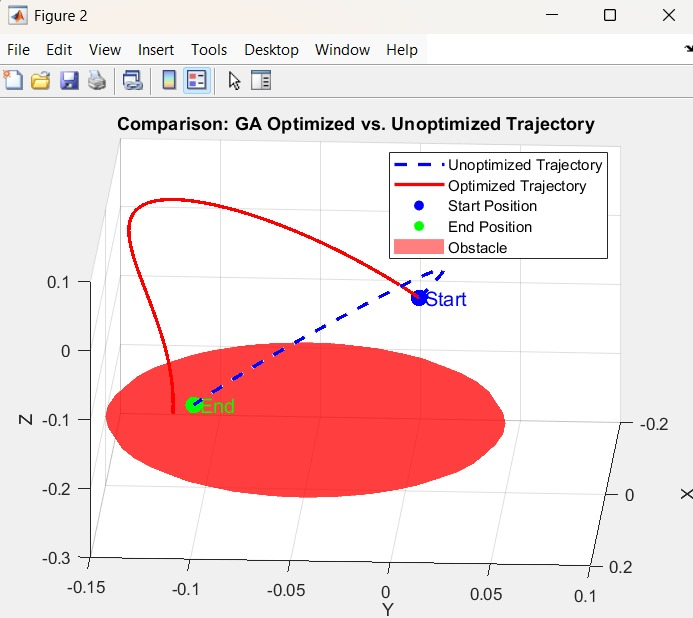

# Trajectory Planning and Optimization for a 6-DOF Robotic Manipulator

This project explores time-optimal trajectory planning and obstacle avoidance for a 6-degree-of-freedom (DOF) serial link manipulator using MATLAB and Peter Corke's Robotics Toolbox. The primary goal is to generate smooth, collision-free paths by comparing standard polynomial trajectories with those optimized by metaheuristic algorithms like Particle Swarm Optimization (PSO) and Genetic Algorithm (GA).

## Key Features

* **Robot Modeling**: A 6-DOF manipulator is defined using Denavit-Hartenberg (DH) parameters.
* **Trajectory Generation**: Implements standard joint-space trajectory planning using cubic (3rd-order) and quintic (5th-order) polynomials.
* **Obstacle Avoidance**: A spherical obstacle is defined in the workspace.
* **Path Optimization**:
    * **Particle Swarm Optimization (PSO)**: Finds an optimal intermediate joint configuration to create a path that avoids the obstacle.
    * **Genetic Algorithm (GA)**: Uses evolutionary principles to find a collision-free trajectory.
* **Visualization**: The robot's motion and the end-effector paths (both optimized and unoptimized) are simulated and plotted in 3D.

---

## Visuals

Here is a comparison of the unoptimized (direct) path and the PSO-optimized path that successfully avoids the obstacle.

**PSO Trajectory Comparison**


**GA Trajectory Comparison**


---

## Dependencies

* **MATLAB** (R2021b or newer recommended)
* **Peter Corke's Robotics Toolbox for MATLAB**. It can be downloaded from the official website or installed via the Add-On Explorer in MATLAB.

---

## Installation and Setup

1.  **Clone the repository:**
    ```bash
    git clone [https://github.com/Naveen15-4/Trajectory-Planning-6DOF-Robot-Arm.git](https://github.com/Naveen15-4/Trajectory-Planning-6DOF-Robot-Arm.git)
    cd Trajectory-Planning-6DOF-Robot-Arm
    ```

2.  **Install Robotics Toolbox:**
    * Download and install the toolbox into your MATLAB path.
    * Ensure you run the toolbox startup script in MATLAB before executing any code:
        ```matlab
        startup_rvc;
        ```

---

## How to Run the Scripts

Navigate to the `src/` directory in MATLAB and run any of the following scripts:

* `pso_algo_6_dof.m`: Runs the simulation for trajectory planning with obstacle avoidance using **Particle Swarm Optimization (PSO)**. It generates a 3D plot comparing the direct path with the optimized path.
* `manipilatir_GA.m`: Runs the simulation for trajectory planning with obstacle avoidance using a **Genetic Algorithm (GA)**.
* `cubic.m`: A basic script to demonstrate 3rd-order polynomial trajectory planning between two points without obstacles.
* `Manupulator_with_obstacles.m`: An alternative implementation using the Puma 560 model from the toolbox to demonstrate PSO.

---

## Project Authors

This project was completed by:
* Vishruth Gowda 
* Jayadev
* Talari Raguram 
* Saksham 
* Naveen 

Project Title: Trajectory Planning and optimization of 6-DOF Manipulator
